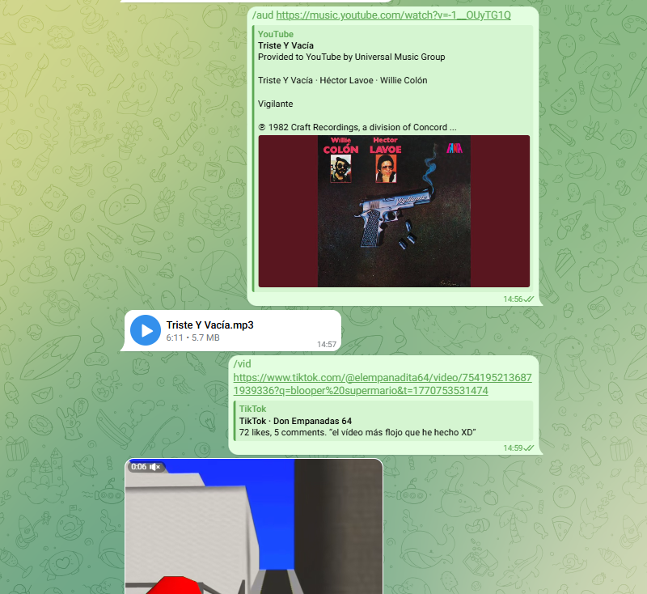

# yt-dlp Telegram Bot
[
](https://mvnrepository.com/artifact/org.telegram/telegrambots/6.9.7.1)
[](https://github.com/yt-dlp)
[
](https://www.oracle.com/java/technologies/javase/jdk21-archive-downloads.html)
[
](https://spring.io/projects/spring-boot)
[
](https://www.ffmpeg.org/)
[
](https://www.docker.com/)

Telegram bot developed in Java with Spring Boot that allows downloading multimedia content from multiple platforms using yt-dlp.



# Running the Telegram bot
## Running in Local
### Prerequisites
- Java 21
- yt-dlp
- PostgreSQL **(local or Remote)**
- ffmpeg
- Telegram Bot token and allowed user ID

The Telegram user ID can be obtained using the [@userinfobot](https://web.telegram.org/k/#@userinfobot) bot.
1. **Clone the repository:**
   ```bash
   git clone https://github.com/SadisOfc/yt-dlp-telegram-bot
   cd yt-dlp-telegram-bot
   ```
   
2. **Set your telegram tokens:**
   ```bash
   export BOT_TOKEN=your_bot_token
   export BOT_USERNAME=your_bot_username
   export OWNER_TOKEN=your_user_id
   export DOWNLOADS_DIRECTORY=downloads/
   export DB_PASSWORD=your_database_password
   export DB_USERNAME=your_database_username
   export DB_URL=jdbc:postgresql://your_database_url
   ```
   
3. **Run the Bot:**
   ```bash
   ./gradlew bootrun
   ```

## Running in Docker
### Prerequisites
- Docker
- PostgreSQL **(local or Remote)**

To run the bot using Docker, environment variables must be defined in a `.env`
file following the `.env.example` provided in the repository.

1. **Create `.env` file**
```.env
BOT_TOKEN=your_bot_token
BOT_USERNAME=your_bot_username
OWNER_TOKEN=your_user_id
DOWNLOADS_DIRECTORY=downloads/

DB_PASSWORD=your_database_password
DB_USERNAME=your_database_username
DB_URL=jdbc:postgresql://host.docker.internal:5432/your_database
```
   **`host.docker.internal`** allows Docker containers to access services running on the host machine.

   If you have a remote database, replace the example URL with the remote URL.

2. **Build the Docker image**
```bash
docker build -t yt-dlp-telegram-bot .
```

3. **Run the container**
```bash
docker run --env-file .env yt-dlp-telegram-bot
```

## License
   MIT License, see [LICENSE](https://github.com/SadisOfc/yt-dlp-telegram-bot/blob/main/LICENSE) for details.