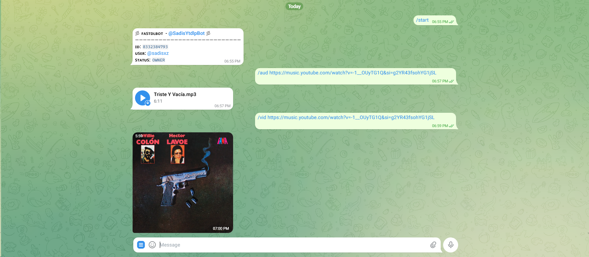

# yt-dlp Telegram Bot (Java & Spring Boot)
[](https://mvnrepository.com/artifact/org.telegram/telegrambots/6.9.7.1)
[](https://github.com/yt-dlp)
[](https://www.oracle.com/java/technologies/javase/jdk21-archive-downloads.html)
[](https://spring.io/projects/spring-boot)
[](https://spring.io/projects/spring-data)
[](https://www.ffmpeg.org/)
[](https://www.docker.com/)
[](https://www.postgresql.org/download/)


Telegram bot developed in Java with Spring Boot that allows downloading multimedia content from multiple platforms using yt-dlp.



# RUNNING THE TELEGRAM BOT
## Running in Local
### Prerequisites
- Java 21
- yt-dlp
- PostgreSQL **(local or Remote)**
- FFmpeg
- Telegram Bot token and allowed user ID

The Telegram user ID can be obtained using the [@userinfobot](https://web.telegram.org/k/#@userinfobot) bot.
1. **Clone the repository:**
   ```bash
   git clone https://github.com/SadisOfc/yt-dlp-telegram-bot
   cd yt-dlp-telegram-bot
   ```
   
2. **Set your telegram tokens:**
   ```bash
   export BOT_TOKEN=your_bot_token
   export BOT_USERNAME=your_bot_username
   export OWNER_ID=your_user_id
   export DOWNLOADS_DIRECTORY=downloads/
   export DB_PASSWORD=your_database_password
   export DB_USERNAME=your_database_username
   export DB_URL=jdbc:postgresql://your_database_url
   ```
   
3. **Run the Bot:**
   ```bash
   ./gradlew bootrun
   ```

## Running with Docker Compose
### Prerequisites
- Docker

To run the bot using Docker, environment variables must be defined in a `.env`
file following the `.env.example` provided in the repository.

1. **Create `.env` file**
```.env
BOT_TOKEN=your_bot_token
BOT_USERNAME=your_bot_username
OWNER_ID=your_user_id
DOWNLOADS_DIRECTORY=downloads/
```
By default, the project uses the PostgreSQL container provided by Docker Compose.

2. **Start the bot**
```bash
docker compose up -d
```
This command will build the bot image, start the bot and the PostgreSQL container

3. **Stop the bot**
```bash
docker compose down
```

### Reset Database
This command deletes the database volume.
```bash
docker compose down -v
```
### Remove Bot Environment
This command removes the bot containers, volumes, and images.
```bash
docker compose down -v --rmi all
```

## Using a Remote Database with Docker Compose
If you want to use an external or remote database, update the following fields in your .env file:
```.env
# Adjust according to the URL and database name
DB_URL=jdbc:postgresql://db:5432/telegram_bot

DB_PASSWORD=your_database_password
DB_USER=your_database_user

# Database name used by PostgreSQL container
POSTGRES_DB=your_database_name
```

# USAGE AND OPTIONS
## General Commands
```bash
/start                  Displays basic information about the current user.

/commands               Displays the full list of available commands with a brief
                        explanation for each one.

/info                   Shows information about the bot, including the technology
                        stack used and the GitHub repository.
              
/vid [URL]              Downloads the video from the provided URL and sends it in the
                        highest available quality supported by the platform.

/aud [URL]              Downloads the audio from the provided URL and sends it in the
                        highest available quality available.

/format [URL]           Shows all available formats for the provided URL, including
                        video resolutions, codecs, and audio-only options.

/format_d [FORMAT_ID] [URL]   Downloads the content using a specific format ID obtained from
                              the /format command.
                              You can choose:
                              video+audio   Download both streams
                              video         Download video only
                              audio         Download audio only
```
## Administration Commands (admin only)
```bash
/user_list              Lists all registered bot users along with their roles and IDs.\

/whitelist_switch       Enables or disables the whitelist system.
                        When enabled:
                        Only whitelisted users can use the bot.
                        Guest users will be blocked.

/add_user [USER_ID]     Adds a user to the whitelist, granting them permission to use
                        restricted commands.

/remove_user [USER_ID]  Removes a user from the whitelist and revokes access to
                        restricted commands.
```

## Telegram File Size Limit

Telegram bots using the **Bot API** can only upload files up to **50 MB**.

If the downloaded media exceeds this limit, the bot will not be able
to send the file.

**More information:**
https://core.telegram.org/bots/faq#how-do-i-upload-a-large-file

## LICENSE
   MIT License, see [LICENSE](https://github.com/SadisOfc/yt-dlp-telegram-bot/blob/main/LICENSE) for details.


